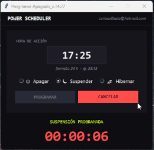
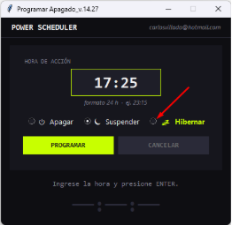
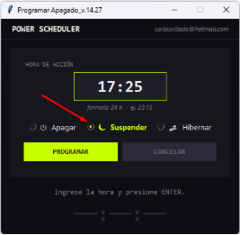
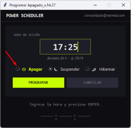

**PROGRMA EL APAGADO DE TU PC**

**🔥** Ideal para cuando dejas descargas o procesos largos, tareas o procesos corriendo.

**⏱️** Ahorra energía

**🔒** Evita dejar tu PC encendido innecesariamente.

**💡** Descárgalo y pruébalo ahora mismo, totalmente gratis

## **🚀 Características**

📆 Programa la Hora de apagado, Suspensión o Hibernacion.

Aplicación de escritorio desarrollada en Python.

` `Interfaz simple y fácil de usar

🖥️ Programa ejecutable (.exe) listo para usar

🆓 Totalmente gratuito

Puedes descargar la versión más reciente desde aquí:

## **👉 Descargar última versión v14.27**

**🛠️ Cómo usar**

Descarga el archivo .zip desde la sección de Releases

Descomprime el archivo.

Ejecuta el archivo .exe y listo.

Nueva versión 14.27.

Mejoras en el diseño, se agrega las opciónes de “Suspender” y “Hibernar”

## **MODO SUSPENSIÓN**

El modo de suspensión consume muy poca energía, el equipo se inicia más rápido y vuelves instantáneamente al punto donde lo dejaste. No tienes por qué preocuparte de perder el trabajo porque se agote la batería, ya que Windows guarda automáticamente todo tu trabajo y apaga el equipo si la batería está demasiado baja. Usa Suspensión cuando vayas a estar fuera de tu PC durante un rato, como cuando tomas un descanso.

En muchos equipos (en especial los portátiles y las tabletas), tu PC se pone en suspensión al cerrar la tapa o al presionar el botón Inicio/Apagado.

## **MODO HIBERNAR**

Esta opción se ha diseñado para portátiles y puede que no esté disponible para todos los equipos. (Por ejemplo, los equipos con InstantGo no tienen la opción de hibernación). La hibernación usa menos energía que la suspensión, y cuando se arranca el equipo de nuevo, vuelves al mismo punto donde lo dejaste (aunque no es tan rápido como la suspensión).

Usa la hibernación cuando sepas que no usarás el portátil o la tableta durante un largo período y que no podrás recargar la batería durante ese tiempo. Comprueba primero si esta opción está disponible en tu PC y, si lo está, actívala.

